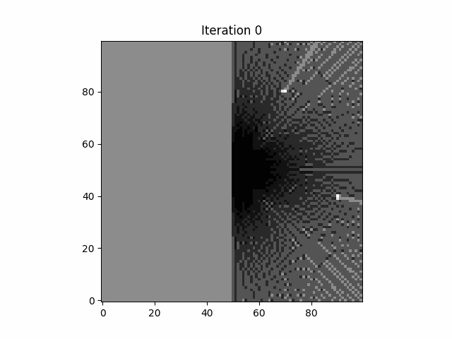
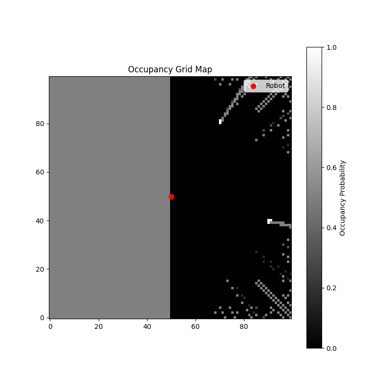

# 🧭 Occupancy Grid Mapping using Probabilistic Sensor Models

*A Python implementation of Bayesian Occupancy Grid Mapping using simulated Lidar data.*

---

## 📌 Overview

This project implements a **2D Occupancy Grid Mapping (OGM)** pipeline — a fundamental component in modern **robotics, autonomous driving, and perception systems**.

The system builds a probabilistic map of the environment using:

- Simulated Lidar measurements  
- Inverse sensor model  
- Log-odds Bayesian updates  
- Ray tracing (Bresenham algorithm)  

This project demonstrates key concepts required for **Perception / Sensor Fusion Engineer** roles.

---

## 🎥 Demo

### 🔁 Mapping Process (GIF)


### 🗺️ Final Occupancy Map


---

## 🧠 Key Concepts Implemented

### ✔ Probabilistic Mapping (Log-Odds)
The occupancy grid uses a **log-odds representation**:

\[
L(x) = \log \frac{P(x)}{1 - P(x)}
\]

This enables:
- Numerically stable updates  
- Efficient incremental Bayesian inference  

---

### ✔ Inverse Sensor Model

For each Lidar beam:

- Cells along the ray → **free space**  
- Endpoint → **occupied**  
- Unknown cells remain unchanged  

---

### ✔ Ray Tracing (Bresenham Algorithm)

Efficient grid traversal is performed using Bresenham’s line algorithm to:

- Identify free cells along each ray  
- Update the endpoint as occupied  

---

### ✔ Sensor Simulation

A configurable Lidar simulator generates:

- Range measurements  
- Angular scans  
- Gaussian noise  

This mimics real-world perception pipelines.

---

## 🏗️ System Architecture

Lidar Simulator → Ray Tracing → Inverse Sensor Model → Log-Odds Update → Occupancy Grid


---

## 📂 Project Structure
```
├── src/
│ ├── occupancy_grid.py
│ ├── lidar_simulator.py
│ ├── utils.py
│ └── main.py
│
├── config/
│ └── default.yaml
│
├── tests/
│ └── test_occupancy_grid.py
│
├── results/
│ ├── map_animation.gif
│ └── final_map.png
│
├── docs/
├── requirements.txt
└── README.md
```

---

## ⚙️ Configuration

All parameters are configurable via:


config/default.yaml


Includes:
- Map size & resolution  
- Sensor parameters  
- Noise model  
- Number of iterations  
- Obstacle positions  

---

## 🚀 How to Run

### Install dependencies:
```bash
pip install -r requirements.txt
python src/main.py
python src/create_gif.py
```
📊 Results

The system successfully reconstructs the environment by:

- Accumulating evidence over time

- Distinguishing free vs occupied space

- Handling sensor noise

🔧 Future Improvements

- Robot motion model (dynamic mapping)

- SLAM (Simultaneous Localization and Mapping)

- Multi-sensor fusion (Radar + Lidar)

- Scan matching (ICP)

- Real-world datasets (KITTI, ROS bags)

## Author
**Vasan Iyer**  
Sensor Fusion Engineer / Autonomous systems / Embedded systems  
Focus: Computer Vision, Sensor Fusion, Autonomous Systems

🎯 Relevance to Industry Roles

##This project demonstrates skills directly applicable to:

- Perception / Sensor Fusion Engineer

- Autonomous Driving Systems

- Robotics Mapping & Localization

##Key competencies:

- Probabilistic modeling

- Bayesian estimation

- Spatial perception

- Sensor modeling

- Algorithm implementation
